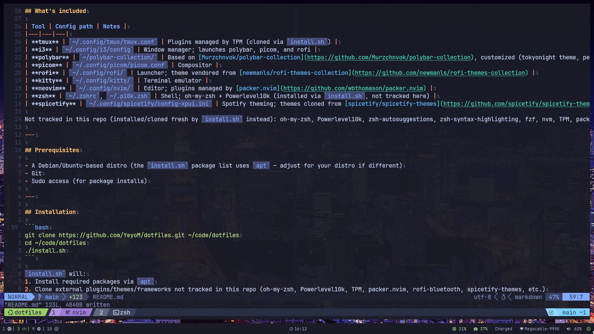
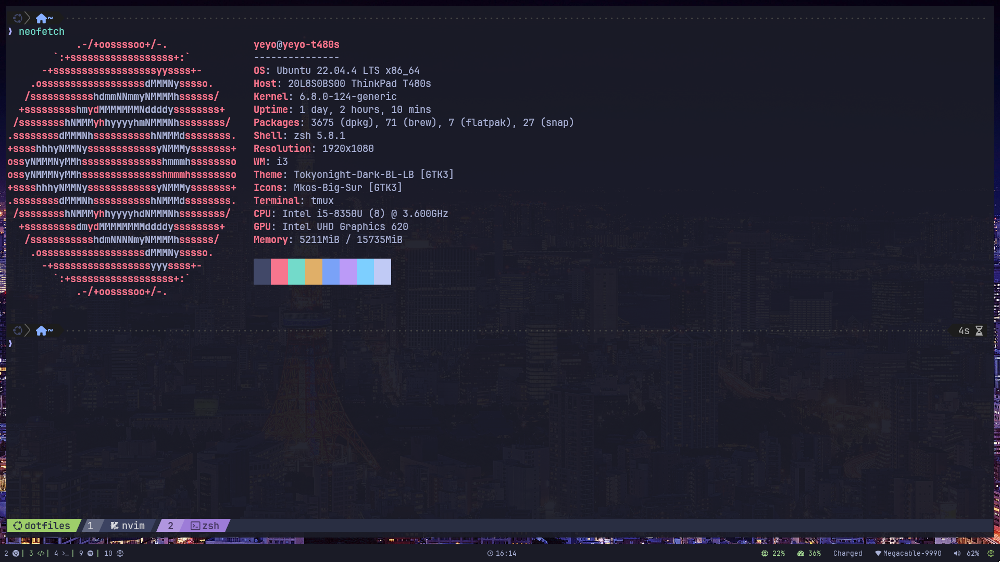
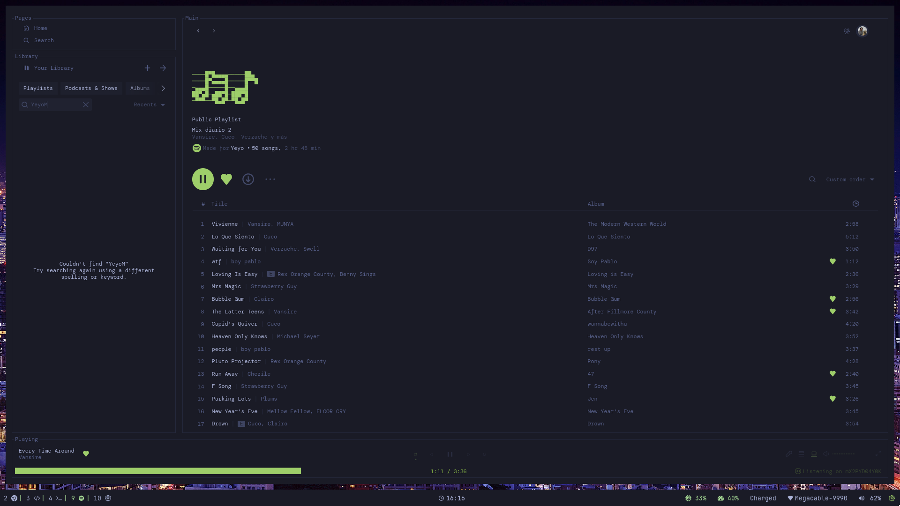

# dotfiles

My personal Linux desktop environment, managed with [GNU Stow](https://www.gnu.org/software/stow/).

i3 + polybar + picom + rofi + kitty + tmux + neovim + zsh, tokyonight-ish across the board.

---

## Showcase






---

## What's included

| Tool | Config path | Notes |
|---|---|---|
| **tmux** | `~/.config/tmux/tmux.conf` | Plugins managed by TPM (cloned via `install.sh`) |
| **i3** | `~/.config/i3/config` | Window manager; launches polybar, picom, and rofi |
| **polybar** | `~/polybar-collection/` | Based on [Murzchnvok/polybar-collection](https://github.com/Murzchnvok/polybar-collection), customized (tokyonight theme, personal modules) |
| **picom** | `~/.config/picom/picom.conf` | Compositor |
| **rofi** | `~/.config/rofi/` | Launcher; theme vendored from [newmanls/rofi-themes-collection](https://github.com/newmanls/rofi-themes-collection) |
| **kitty** | `~/.config/kitty/` | Terminal emulator |
| **neovim** | `~/.config/nvim/` | Editor; plugins managed by [packer.nvim](https://github.com/wbthomason/packer.nvim) |
| **zsh** | `~/.zshrc`, `~/.p10k.zsh` | Shell; oh-my-zsh + Powerlevel10k (installed via `install.sh`, not tracked here) |
| **spicetify** | `~/.config/spicetify/config-xpui.ini` | Spotify theming; themes cloned from [spicetify/spicetify-themes](https://github.com/spicetify/spicetify-themes) |

Not tracked in this repo (installed/cloned fresh by `install.sh` instead): oh-my-zsh, Powerlevel10k, zsh-autosuggestions, zsh-syntax-highlighting, fzf, nvm, TPM, packer.nvim, rofi-bluetooth, spicetify-themes. See [Credits](#credits) below.

---

## Prerequisites

- A Debian/Ubuntu-based distro (the `install.sh` package list uses `apt` — adjust for your distro if different)
- Git
- Sudo access (for package installs)

---

## Installation

```bash
git clone https://github.com/YeyoM/dotfiles.git ~/code/dotfiles
cd ~/code/dotfiles
./install.sh
```

`install.sh` will:
1. Install required packages via `apt`
2. Clone external plugins/themes/frameworks not tracked in this repo (oh-my-zsh, Powerlevel10k, TPM, packer.nvim, rofi-bluetooth, spicetify-themes, etc.)
3. Symlink every config folder into place with `stow`

A few manual steps remain after running the script (also printed at the end of it):
- Open tmux and press `prefix + I` to install plugins via TPM
- Open neovim and run `:PackerSync` to install plugins via packer
- Run `spicetify backup apply` if it wasn't already applied
- Log out/in (or reboot) so i3 and zsh fully apply as your window manager/shell

---

## Repo structure

Each top-level folder mirrors its path relative to `$HOME`, which is what Stow expects:

```
dotfiles/
├── install.sh
├── README.md
├── .gitignore
├── tmux/.config/tmux/
├── i3/.config/i3/
├── picom/.config/picom/
├── rofi/.config/rofi/
├── kitty/.config/kitty/
├── nvim/.config/nvim/
├── zsh/.zshrc, .p10k.zsh
├── spicetify/.config/spicetify/config-xpui.ini
└── polybar-collection/polybar-collection/   (home-level tool, not under .config)
```

## Adding a new tool later

```bash
mkdir -p ~/code/dotfiles/<tool>/.config      # or home-level path if not XDG-compliant
mv ~/.config/<tool> ~/code/dotfiles/<tool>/.config/<tool>
cd ~/code/dotfiles
stow -v -t ~ <tool>
readlink -f ~/.config/<tool>                 # verify the symlink resolved correctly
```

Remember to check for plugin/cache/data subfolders that shouldn't be tracked (see `.gitignore`) before moving anything.

---

## Credits

This repo vendors or depends on the following third-party projects — full credit to their authors:

- [Murzchnvok/polybar-collection](https://github.com/Murzchnvok/polybar-collection) — base for the polybar setup, customized here
- [newmanls/rofi-themes-collection](https://github.com/newmanls/rofi-themes-collection) — rofi theme
- [ClydeDroid/rofi-bluetooth](https://github.com/ClydeDroid/rofi-bluetooth) — bluetooth menu for rofi
- [spicetify/spicetify-themes](https://github.com/spicetify/spicetify-themes) — Spotify themes
- [romkatv/powerlevel10k](https://github.com/romkatv/powerlevel10k) — zsh prompt theme
- [ohmyzsh/ohmyzsh](https://github.com/ohmyzsh/ohmyzsh) — zsh framework
- [tmux-plugins/tpm](https://github.com/tmux-plugins/tpm) — tmux plugin manager
- [wbthomason/packer.nvim](https://github.com/wbthomason/packer.nvim) — neovim plugin manager
